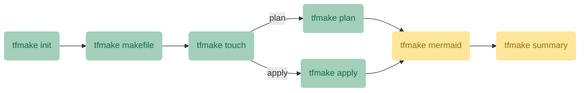

# tfmake

tfmake is a tool for automating Terraform with the power of make.

## Requirements
- bash 4+
- yq
- make

## Installation

### Git

```bash
git clone git@github.com:tfmake/tfmake.git
sudo cp -r tfmake/usr/local/* /usr/local/
sudo chmod +x /usr/local/bin/tfmake
```

## Usage

```
Usage:
  tfmake command [options] [args]

Available Commands:
  apply             Execute the apply Makefile.
  cleanup           Cleanup the data directory.
  gh-pr-comment     Add a comment to a GitHub pull request.
  gh-step-summary   Add content to GitHub Step Summary.
  init              Initialize the data directory for Terraform plan or apply execution.
  makefile          Generate a Makefile for Terraform plan or apply execution.
  mermaid           Generate a Mermaid flowchart diagram from Terraform modules and their dependencies.
  plan              Execute the plan Makefile.
  summary           Create a Markdown summary.
  touch             Touch modified files.
  version           Show the current version.

Other options:
  -h, --help, help  Print this help and exit.
  -v, --version     An alias for the "version" subcommand.
```

### Basic sequence of commands



### GitHub Actions commands

The commands `tfmake gh-step-summary` and `tfmake gh-pr-comment` are related to GitHub Actions.
## License

[MIT License](https://github.com/tfmake/tfmake/blob/main/LICENSE)
