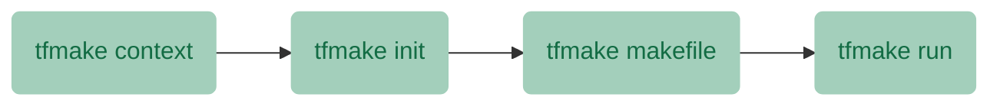

# tfmake

**tfmake** is a tool for automating Terraform with the power of make. It is designed for projects with multiple modules; particularly when dependencies among them are present and an ordered execution is required.

## Requirements

- bash 4+
- yq
- make

## Limitations

- To ensure an ordered execution, all dependencies between modules MUST be explicitly declared.
- A module path SHOULD NOT contain spaces; e.g. use `sample_module` instead of `sample module`.

## Installation

### Git

```bash
git clone https://github.com/tfmake/tfmake.git
sudo cp -r tfmake/usr/local/* /usr/local/
sudo chmod +x /usr/local/bin/tfmake
```

## Usage

```
Usage:
  tfmake command [options]

Core Commands:
  context           Set the execution context: plan, apply, or destroy.
  init              Initialize the data directory for Terraform execution.
  makefile          Generate a Makefile for Terraform execution.
  run               Run the generated Makefile for Terraform execution.

Other Commands:
  cleanup           Cleanup the data directory.
  config            Modify tfmake configuration.
  graph             Generate a graph from Terraform modules and their dependencies.
  summary           Create a Markdown summary.
  touch             Touch modified files.
  version           Show the current version.

Shortcut Commands:
  plan              Shortcut for core commands using the "plan" context.
  apply             Shortcut for core commands using the "apply" context.
  destroy           Shortcut for core commands using the "destroy" context.

GitHub Commands:
  gh-pr-comment     Add a comment to a GitHub pull request.
  gh-step-summary   Add content to GitHub Step Summary.

Global options:
  -h, --help, help  Print this help and exit.
  -v, --version     An alias for the "version" subcommand.
```

## How tfmake works

### The .tfmake file

**tfmake** is based on the _explicit declaration_ of dependencies between modules. In a Terraform project, this could be inferred from the usage of `terraform_remote_state` data resource; although implicit dependencies cases could exist.

The syntax for the `.tfmake` file is as follow:

```YAML
dependencies: [<module>, <module>, ..., <module>]
```

e.g. if module C depends on A and B, the following declaration is needed:

```YAML
dependencies:
  - A
  - B
```

> All dependencies MUST be declared. Omitting some of them based on transitivity is discouraged.

### Core commands

Similar to Terraform, **tfmake** is composed of multiple commands, each one playing an important role in a predefined sequence.

The core sequence is made up of four commands, as illustrated in the next diagram.



#### tfmake context

Allows to define the Terraform command to execute: `plan`, `apply`, or `destroy`.

```
tfmake context plan
```

#### tfmake init

As the name suggests, this command deals with the initialization process, used to discover the Terraform modules, and their dependencies. That information is persisted for further usage.

```
tfmake init
```

Sometimes, a requirement arises to ignore some modules inside a project. The option `-i|--ignore` supports it, by passing  a space separated list of modules.

```
tfmake init -i "X Y Z"
```

#### tfmake makefile

This command acts like a code generator, using the information gathered by **init** to create a `Makefile`. Each module is added as a _target_, with their files and dependencies as _prerequisites_. The **tfmake** context determines the Terraform command to use as part of the _target's recipes_.

```
tfmake makefile
```

What follows is an adapted example for a three-module project plan `Makefile`.

```Makefile
all: A B C

A: $(wildcard A/*.tf A/*.tfvars)
	terraform -chdir="A" init
	terraform -chdir="A" plan

B: $(wildcard B/*.tf B/*.tfvars) A
	terraform -chdir="B" init
	terraform -chdir="B" plan

C: $(wildcard C/*.tf C/*.tfvars) A B
	terraform -chdir="C" init
	terraform -chdir="C" plan
```

When the `Makefile` is there, it's possible to use it for running the [make](https://man7.org/linux/man-pages/man1/make.1.html) utility.

One of the goals of **tfmake** is to avoid unnecessary executions. If a module (_target_) files or their dependencies don't change, there is no need to run a `plan`, `apply`, or `destroy` on it. This behavior, derived from the `make` way of working, reduces the execution time and favors cost optimization.

> The make program uses the makefile description and the last-modification times of the files to decide which of the files need to be updated.

#### tfmake run

As mentioned before, a `Makefile` is the entrypoint for `make` execution. The **run** command brings some advantages over it, including multiple modes of execution and a proper handling of failures for CI/CD pipelines.

By default (`tfmake run`), the command calls `make` and runs it with the semantics described above, avoiding unnecessary executions. However, two other modes exist with the options `--all` and `--dry-run`.

The first one executes Terraform `plan`, `apply`, or `destroy` for all modules, whereas the second is similar to the default mode, producing a list of modules but without running their recipes.

### A special command

#### tfmake touch

The **touch** command is a wrapper over the corresponding Linux utility, and is used to change the modification time of modules files. This is mandatory in a GitHub Actions workflow after a [checkout](https://github.com/actions/checkout) or could be used in a local environment to force the `make` semantics.

For instance, using the modules A, B and C; a change in a `.tf` file inside B will cause the execution of it and C in that order.

The command could be executed with the option `-f|--files` and a list of space separated files.

```
tfmake touch -f "A/main.tf B/main.tf"
```

is equivalent to

```
tfmake touch -f "A/main.tf" -f "B/main.tf"
```

> In a GitHub Actions workflow use `tj-actions/changed-files` to get the list of changed files.

### Outputs and feedback

When the **run** command is finished, the outputs from Terraform executions for each module are stored for further processing. The **summary** command produces a report in Markdown format, after joining them all.

When running `tfmake` as part of a GitHub Actions workflow, it is possible to use the report to provide feedback in two different ways.

The first is by means of a Pull Request comment, with the help of the following command.

```
tfmake gh-pr-comment --number "${{ github.event.pull_request.number }}"
```

The second alternative is based on the GitHub Actions Step Summary feature, with the help of the **gh-step-summary** command.

## License

[MIT License](https://github.com/tfmake/tfmake/blob/main/LICENSE)
